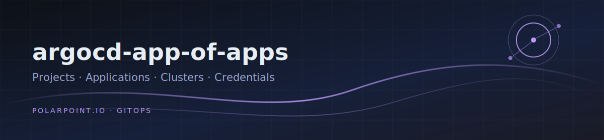

# argocd-app-of-apps

Helm chart managing ArgoCD Projects, Applications, ApplicationSets,
Clusters, credential templates and Git/Helm repositories — secrets
delivered by External Secrets Operator from `cluster-secrets-store`.

Consumed by [argocd-core](https://github.com/polarpoint-io/argocd-core)
as the `argocd-app-of-apps` Application; per-environment values live
there (`<env>-aoa-values.yaml`).

## Values surface

- `global` — namespace, cluster name, default sync policy, repository
  whitelist (`defaultRepositories`)
- `projects[]` — AppProjects with admin/rw/ro roles and the parent
  `applications[]` that point at role repos' `releases/` charts
- `clusters[]` — local + downstream cluster registration (ExternalSecret
  templated bearer token/CA per cluster)
- `privateGitCredentialsTemplates` / helm equivalents — repo-creds via ESO

## Release

Tag releases (`vX.Y.Z`) — argocd-core pins `aoa_version` to a tag.
